# Mac OS X Setup Checklist

## Hardware
Apple generally requires that you run the latest released version of macOS. As of Fall 2016, you should plan to get a Mac that can run El Capitan and is on the supported list for macOS Sierra. The machine should have a 64-bit Intel processor, 10GBs of free disk space, and a minimum of 4G of RAM; the more RAM the better. Avoid computers made prior to 2008 as they will likely not be sufficient to run the tools on.

### Officially supported machine list for macOS Sierra
The following machines are supported by Apple for running the latest macOS version.

- iMac – all models from late 2009, iMac 10,1 – 17,1
- MacBook – all models from late 2009, MacBook  6,1 – 9,1
- MacBook Pro – all models from 2010, MacBook Pro 7,1 – 11,5
- MacBookAir – all models from 2010, MacBook Air 3,1 – 7,2
- Mac Mini – all models from 2010, Mac Mini 4,1 – 7,1
- Mac Pro – all models from 2010, Mac Pro 5,1 – 6,1

The number presented here is the model identifier, you can retrieve that on the Mac using:

`Apple Menu > About This Mac > System Report … Model Identifier`

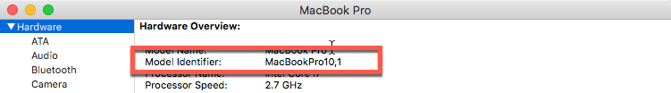

You can also retrieve the model information from a terminal session:

`system_profiler SPHardwareDataType`

## Software

1.  Verify that your Mac is running the _latest_ released version of macOS. You can get this information from **About This Mac** in the system menu as shown above.

2.  Install the latest version of [XCode from the Mac App Store](https://itunes.apple.com/us/app/xcode/id497799835?mt=12).

3. Launch Xcode to accept the licensing agreements and download additional runtime files necessary for development.

4.  Install **Xamarin Studio** using the Xamarin unified installer
    available from [xamarin.com/download](http://xamarin.com/download). The installer will automatically include any tools and SDKs needed for Android
    development. This may take a while depending on what is already
    installed on the computer since it may have to download fairly large
    SDKs.

5.  Launch **Xamarin Studio** - it will be in your **Applications**
    folder, or you can use Spotlight to locate and launch the
    application.

6.  Verify you are on the *Stable* channel (this is the default) and
    that you have the latest updates installed. You can check this
    through the **Xamarin Studio \> Check For Updates** system menu
    option.

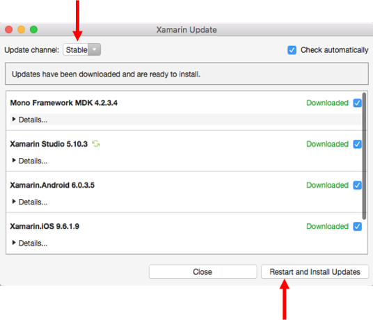

## Running mobile applications

As you design, build and run your applications, you will want to test them locally before making them available to the world. You have two choices for local testing:

1. Testing with a physical device
2. Testing on a simulated device

We recommend using physical devices when possible - these provide the best testing experience that will be as close to what your users will see. However, you likely don't have every possible variation of hardware and software available to test on, so you will need to turn to simulators and emulators to fully test your applications.

Just always keep in mind that simultors and emulators are not the real thing - they often will be faster than a physical device (because they are running on your computer's hardware), don't expose all the features available (Bluetooth, NFC, etc.), and sometimes even use different runtime environments. Just because it runs on a simulator/emulator doesn't mean your app runs correctly on a real device - always test on both.

### Testing with an iOS Device

You can run your applications on a physical iOS device plugged into your
Mac using a USB cable. You must first configure the device for
development purposes. The easiest way to do this is to use XCode – we
have a [video tutorial on how to do this with your device.](https://university.xamarin.com/lightninglectures/setting-up-an-ios-device-for-deployment)

### Testing with the iOS Simulator

The iOS Simulator is included as part of XCode and will be automatically launched by Xamarin Studio when you select a simulated device from the Xamarin Studio toolbar. You can choose which simulator to launch (iPhone vs. iPad, and iPhone variations) through this toolbar along the top of your Xamarin Studio IDE window:

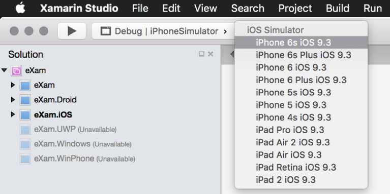

By default, only the latest simulator is installed by Xcode, however you can also install other versions by launching Xcode and using the **Preferences > Components** dialog.

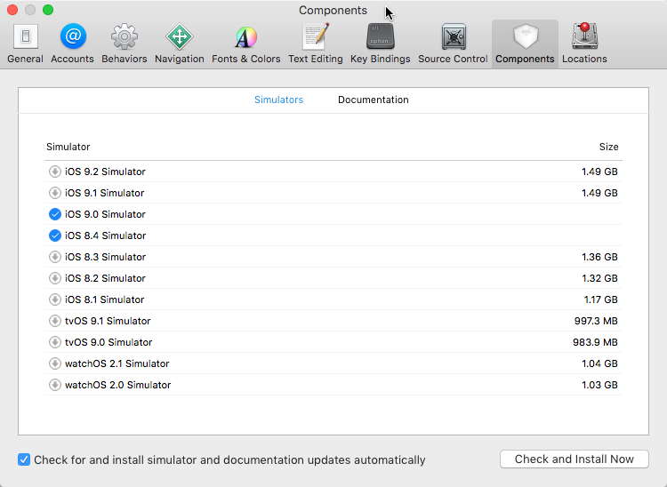

This is particularly important as Apple releases new versions of iOS; the simulator is not updated automatically - so you will need to use this dialog to install _newer_ versions of iOS devices on your Mac.

### Testing with an Android device

As mentioned above, it's recommended that you use a physical Android device for testing. This is often easier to setup, and gives a more realistic view of the end-user experience. The device must be plugged into your Mac through a USB cable and be setup for **USB debugging**. On Android KitKat (4.4) and above this requires a few steps. 

> Note that on some devices, the steps might vary slightly - if they don't match the instructions below, try searching for your specific vendor and turning on device debugging.

1.  On the device, open **Settings\> About\> Software Information\>
    More**.

2.  Tap **Build number** seven times to enable Developer options. On the
    seventh tap, it will display “You are now a developer!”

3.  Go back to the **Settings** menu and now you'll be able to see a “Developer
    options” menu item.

4.  Tap it and turn on USB Debugging from the menu on the next screen.
    When you connect it to the computer, it will prompt you to allow USB
    debugging – make sure to check the **Always allow from this
    computer** to avoid the prompt in the future.

### Testing with Android emulators

You can also use an emulator to test Android applications. We recommend
the Android SDK emulators which are installed with [Android Studio](https://developer.android.com/studio/index.html). These are hardware accelerated, kept up to date by Google and you can download images which have Google Play services pre-installed.

1.  Download and run the [Android Studio installer](https://developer.android.com/studio/index.html). It will install all the required Android development pieces as well as the emulators.

2.  Once installed, run the application and click the **Configure**
    button at the bottom of the Welcome Screen. Select **SDK Manager**
    from the drop down.

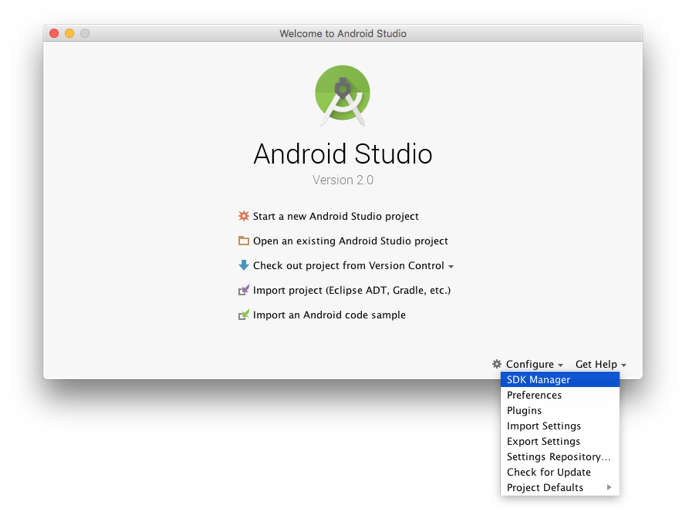

3.  Make sure you have the SDK Platform installed for several recent
    versions of Android. These are the libraries used by the build
    process to access the Java APIs in your Android applications. We
    recommend you install 4.0 through 6.0, but adding more won’t hurt
    anything (beyond using disk space).

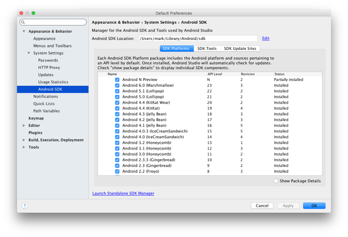

4.  Switch to the SDK Tools tab and make sure that all of the extra SDK
    elements are installed. We won’t actually need most of this for the
    training, but as you get into Xamarin.Android development, much of
    this becomes a requirement.

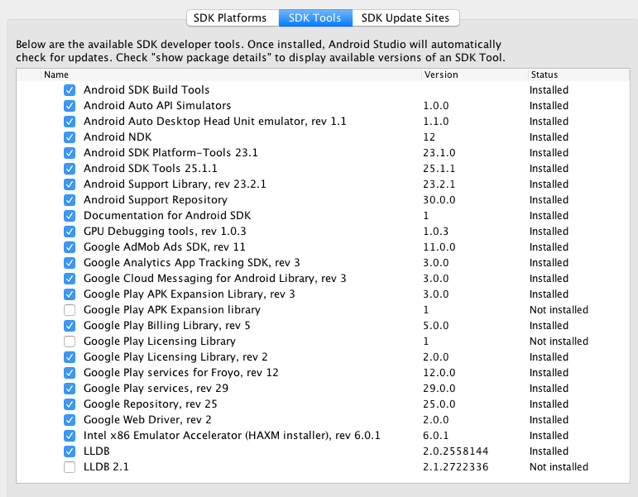

#### Create at least one modern Android Virtual Device

It's recommended to have at least one modern (V5, 6 or 7) Android Virtual Device (AVD) defined. You will want to test on each Android version you can run on to ensure your app works properly on each target. The most common variation is a phone form-factor, but if you are building for tablets, you can choose a larger emulated device as well.

Unfortunately, the AVD dialog is only available in an active project, so to access the wizard, you will need to generate a new project with Android Studio.

1.  Click **OK** to dismiss the SDK dialog if it’s still open and return
    to the Welcome Screen. If you rebooted your computer, then re-open
    Android Studio.

2.  Create a new Android project by clicking the **Start a New Android
    Project** link on the Welcome Screen.

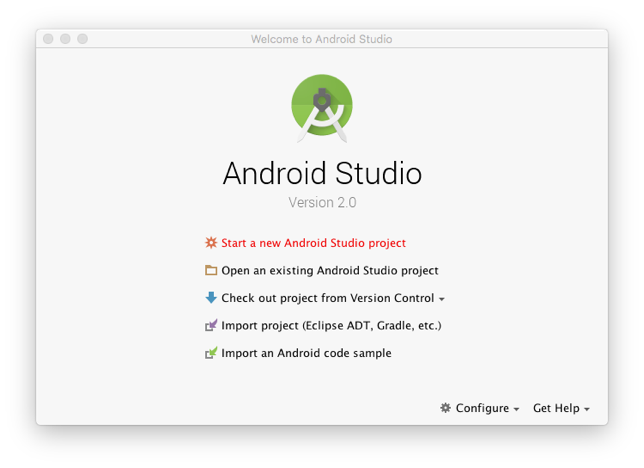

3.  Go through the wizard dialog and generate a blank Android app. It
    doesn’t matter what type of project it is and you won’t need to
    compile it – but the emulator options are only available from the
    IDE window. You can delete the project once we are finished
    configuring the emulators.

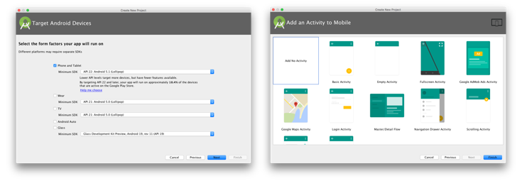

4.  Once the IDE is showing, click the **AVD button** in the toolbar –
    it will have a tooltip if you have trouble finding it.

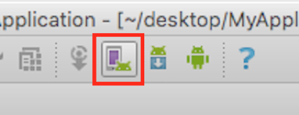

5.  This will display the Android Virtual Device Manager where you can
    add, remove and edit your emulators. Click the **Create Virtual
    Device...** button at the bottom to create a new emulator.

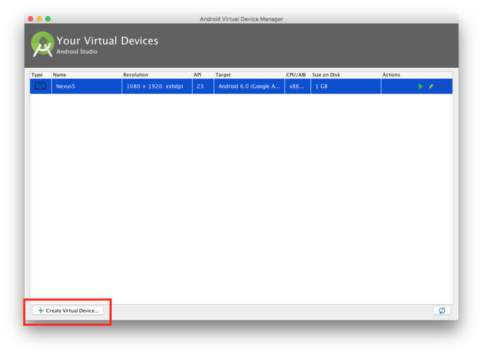

6.  Next, walk through the wizard to create an emulator image – we
    recommend you do this twice so you have both a phone and tablet
    image.

 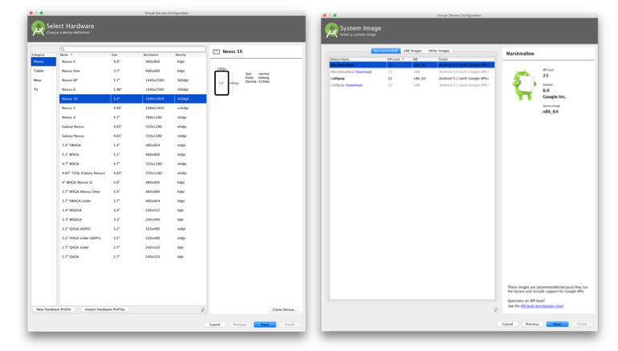

7.  You can click the **Advanced** button on the emulator settings
    screen to get to additional settings.

 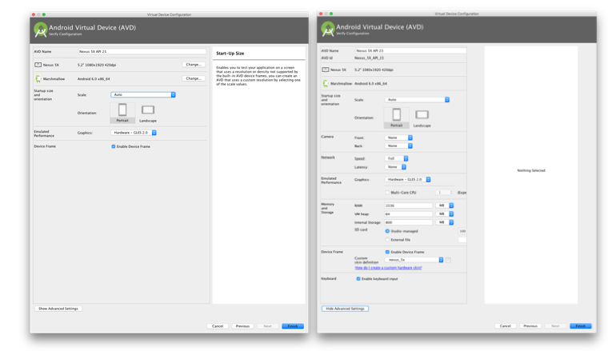

8.  Click **Finish** to create the image. Once it’s created, it will be
    available to Xamarin Studio through the devices dropdown, however
    any editing or changes to the image definition should always be done
    through this Android Studio UI rather than the UI included with the
    Android SDK as they can sometimes overwrite each other and cause
    issues.

## Verify your installation

To validate your Xamarin installation on a Mac, we will use Xamarin Studio to create a new **Xamarin.Forms** application and then run it on both iOS and Android to check both environments. 

Start by creating a new Xamarin.Forms project. Open Xamarin Studio and use the New Project wizard: **File \> New Solution \> Multiplatform \> App \> Forms App** (Note: the newest versions of Xamarin Studio use the term “Multiplatform” here while previous versions used “Cross-platform”). You will use this to test your setup and make sure you can build and run both iOS and Android applications.

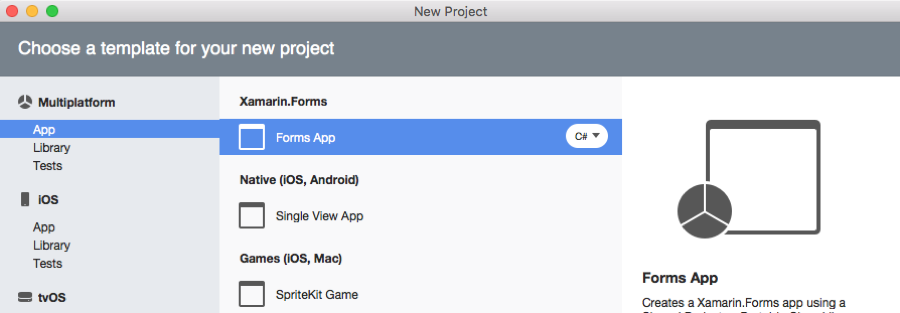

### Testing iOS on OS X with Xamarin Studio

1.  Make sure the iOS platform project is the current startup project in
    the IDE – it should be in **bold** in the solution pad. You can
    right-click and choose *Set As Startup Project* to change it if
    necessary.

2.  Select the **Debug** configuration and one of the **iOS Simulator**
    choices in the toolbar, for example the **iPhone 6s iOS 9.3**
    choice:

> 

1.  Click the "Run" button in the toolbar (looks like a "Play" icon).

2.  It should build the application and then run it in the simulator and
    display some text.

### Testing Xamarin.Android on OS X with Xamarin Studio

1.  Make sure the **Android** platform project is the active project in
    Xamarin Studio (you can right-click and choose *Set As Startup
    Project* to change it if necessary).

2.  Select the **Debug** configuration and one of the choices in the
    emulator drop-down. If you don't see any choices, or you would like
    to configure the choices available, use the instructions described
    above.

3.  Click the "Run" button in the toolbar (looks like a "Play" icon). It
    should build the application and then run it in the selected
    emulator.

## Troubleshooting

Most of the time, everything will install and run smoothly. However, if you have trouble with any of the steps, or you find that you cannot build or run the test application, check out our [Troubleshooting Guide](./troubleshooting).
