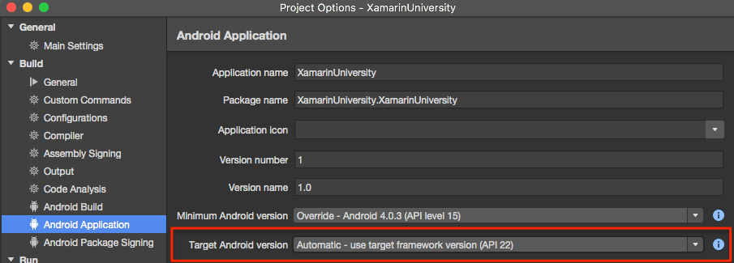
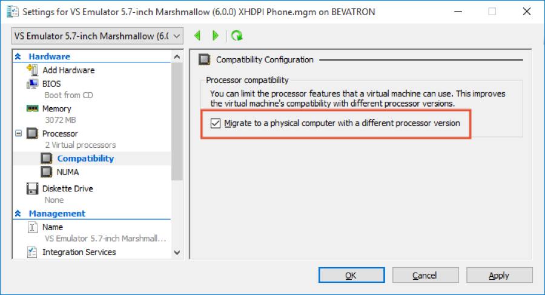
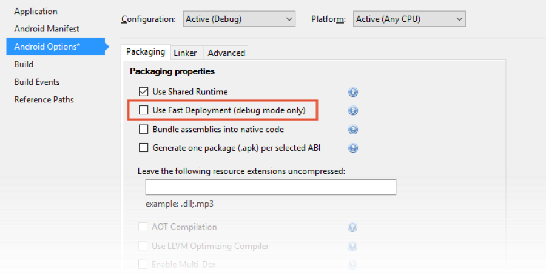

# Troubleshooting

## Common Build Problems

When you have trouble with a specific class, make sure to check the FAQ link available on the [Classes Page](https://university.xamarin.com/classes).

Also, make sure you are on the *stable* update channel, and that you have applied any released updates or fixes to your development environment, both from Xamarin and Microsoft if you are using Visual Studio.

---
***My Xamarin.Android application fails to build and says something about missing SDK version***

If the *Android* application fails to build, the first thing you should
verify is that you have the proper Android SDK versions installed. If not, you will often get an error that reads something like this 


To correct this, install the proper runtime versions using the Android SDK Manager (**Tools \> Open Android SDK Manager…** or **Tools \> Android \> SDK Manager**).

Alternatively, you can open the Xamarin.Android project configuration and change the **Target Android Version** to an SDK version you have installed.



Or you can set your Target **Version** to "Automatic" and set your Target **Framework** to "Use Latest".  Target Framework is set in the General Tab.


---
**Android project fails to build and gives an error indicating a file failed to unzip, a zip file is invalid, or an error similar to "Please install package: 'Android Support Library' available in SDK installer."**

Android projects utilize a suite of support libraries from Google - these provide backwards compatibility, additional SDK features, and bindings to the native APIs exposed in the OS. The managed wrappers are all installed through NuGet, but the _native_ libraries are not. These native libraries are downloaded by the IDE from a Google server (m2repository) as zip files and are then unzipped and used for each of your Xamarin.Android projects that include the support libraries or Google Play. 

Sometimes, the download will fail or be interrupted and the IDE will get confused and give build errors. To correct this, you can delete the zip folder and all of the unzipped libraries. The next build will re-download all the required files. This will add time to that first build - but it will correct these sorts of problems.

On Windows, the cache is located at `%USERPROFILE%\AppData\Local\Xamarin`, on macOS it's in `/Users/[Username]/.local/share/Xamarin/`. There will be a folder for each Android support library:


Inside these folders will be each version that has been downloaded. Delete each of these folders (or just the ones reporting errors) and the **zips** folder which contains the originally downloaded file. **DO NOT DELETE THE Mono for Android folder**.

Then rebuild your project - this should kick off an MSBuild task to re-download the zip and extract the library for the Android version your app is targeting.

---
***Cannot set a project as active in a lab solution***

If you find that the **Set As Active Project** option is not available, or that the IDE is not listing the expected simulators/emulators in the devices drop-down, this often occurs because the build setting is incorrect. In particular, projects created with Visual Studio have different [build configurations](https://msdn.microsoft.com/en-us/library/kkz9kefa.aspx) for the different iOS settings - Simulator vs. Device vs. Adhoc deployment. When this build environment is not set correctly, the IDE will often restrict what you can set as active and what can be run in the debugger.

---
***The common-code Portable Class Library (PCL) is not being built and/or deployed with my platform-specific project***

This is often an indication that the solution configuration is not correct. The solution tracks the dependencies between projects and ensures that it builds those dependencies in the correct order. Sometimes, particular with Xamarin.Forms, the solution configuration can be missing a dependency which causes the shared code to not be built and deployed properly. You can fix this by editing the [solution configuration](https://msdn.microsoft.com/en-us/library/bb166577.aspx) in either Visual Studio, or Xamarin Studio through the solution options (right-click on the solution, **Options > Build > Configurations**).

---
***I'm getting a compile-time error in Visual Studio about NuGet packages being missing and needing to be restored, but it looks like they are there!***

This is very likely due to an invalid `Target` tag in the **.csproj** file that is added by Visual Studio and ignored by Xamarin Studio. If you update the required NuGet packages in Xamarin Studio, it leaves these old tags in place and causes this type of error.

To fix it, edit the **.csproj** of the project which is reporting the error in a text editor and locate the tags which have the error message. They will look something like this:

```
<Target Name="EnsureNuGetPackageBuildImports" BeforeTargets="PrepareForBuild">
    <PropertyGroup>
      <ErrorText>This project references NuGet package(s) that are missing on this computer. Enable NuGet Package Restore to download them.  For more information, see http://go.microsoft.com/fwlink/?LinkID=322105. The missing file is {0}.</ErrorText>
    </PropertyGroup>
    <Error Condition="!Exists('..\..\packages\Xamarin.Forms.1.3.1.6296\build\portable-win+net45+wp80+MonoAndroid10+MonoTouch10+Xamarin.iOS10\Xamarin.Forms.targets')" Text="$([System.String]::Format('$(ErrorText)', '..\..\packages\Xamarin.Forms.1.3.1.6296\build\portable-win+net45+wp80+MonoAndroid10+MonoTouch10+Xamarin.iOS10\Xamarin.Forms.targets'))" />
  </Target>
```

You can either update the package it is looking for, or just remove the entire `Target` tag altogether - it's a prompt to restore the missing package and not required to actually build the project. Once you've edited the file, save it and reload it in Visual Studio and you should be able to build the project.

---
***Problems with the Xamarin.iOS Build Host***

See this helpful documentation page on [iOS build host troubleshooting](http://developer.xamarin.com/guides/ios/getting_started/installation/windows/troubleshooting/)

---
***Application crashes immediately after deploying to Android Emulator.***

If you have multiple Android SDK versions installed, there is a rare chance that apps can be built in a way that will crash immediately after you start them. This appears to be related to deploying to an emulator running an SDK version older than the latest you have installed. If you encounter this error, as a quick fix, you can simply tell it to not use the latest SDK version to build.

To do this in Xamarin Studio, right-click your Android project and choose **Tools \> Edit File**. This will open the file to see the raw XML.

In Visual Studio, right-click your Android project and choose Unload Project. After it is unloaded, you can right-click and choose "Edit YourProject.csproj" to see the raw XML.

Once you are editing the project XML, find the `AndroidUseLatestPlatformSdk` property and set it to `False` to fix the issue.

```
<AndroidUseLatestPlatformSdk>False</AndroidUseLatestPlatformSdk>
```

Save the changes to your project file. Xamarin Studio will automatically load the changes. In Visual Studio, right-click the unloaded project and choose "Reload Project".

## Common runtime issues

---
***Android application builds but fails to deploy to the device/emulator, or I get a DWP Handshake failed from the Visual Studio Android Emulator***

Try turning off "Use Fast Deployment" in the project settings for the Xamarin.Android application. This is on the **Android Options** tab of the project settings. 

---
***The debugger is not connecting to the Android emulator***

If you have trouble connecting or launching the emulator from the IDE, try launching the Android emulator *before* you run your program and then *keep it running*. If the IDE fails to detect the emulator, then close it and restart it. It should detect the running emulator on launch and then the emulator will show up in the available choices in the toolbar.

> **Note** that the Android emulator must be running on the *same
machine*. So, if you are running Visual Studio in a Windows VM, you will
need to launch an emulator in that VM to see it. There is a technique
you can use to connect to a networked instance of an emulator using the
**adb** command-line tool in the SDK – ask the instructor to walk you
through the steps if you are interested in this approach.

Sometimes, the problem is that you have multiple copies of the Android SDK installed and the emulator is using one version and the IDE is using another. They must be using the same version of **adb** to connect. Verify that you only have one copy of the SDK and that the emulator and IDE are both pointing to the same path. You can configure the IDE path in the Android settings under **Xamarin Studio \> Preferences \> Projects \> SDK Locations \> Android** or **Tools \> Options \> Xamarin \> Android Settings**. 

---
***The IDE is not detecting my Android device even though it's plugged in***
If you're unable to detect a physical Android device connected
to your Windows machine, you may need to install a USB driver; check the manufacture's website for a compatible driver or use the generic Google supplied USB driver.

---
***Android Emulator for Visual Studio fails to launch**

If the Visual Studio Android emulator fails to launch, this may be because you have a newer (Skylake) processor set. This includes the Surface Book i7, Surface Pro 4, and other newer computers. In these cases, the newer Skylake
processors have an issue with the current build of the VS Android
Emulator. They will install and appear to run, but VS will be unable to
connect to the emulator. The app will launch and then exit.

The issue is related to Hyper-V on Windows 10 when running on the latest
Intel (Skylake) processors. The images were built for the earlier
iteration of the CPU hardware and Hyper-V has trouble executing it on
the newer architecture. Fortunately, the fix is quite easy:

- Open the Hyper-V manager using the Start menu:


- In the Hyper-V manager, right click on the Android VM you are using.
- Click **Settings**
- Expand "Processor", select "Compatibility"
- Enable "Migrate to a physical computer with a different processor version" as shown here:



---
***The Visual Studio Android Emulator stops with the diagnostic message: libaot-mscorlib.dll.so not found***

To resolve this error, use the following steps to disable fast
deployment:

- Open the project properties for the Android project.
- Click Android Options and unselect **Use Fast Deployment** (debug mode only):

> 
