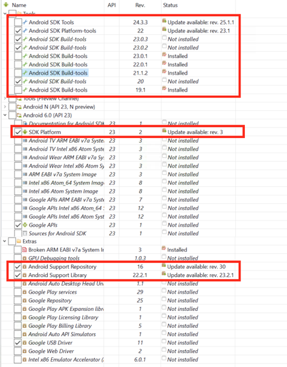

# Getting ready for Xamarin University with Windows

Welcome to Xamarin University! This guide is to help you get your Windows development environment setup and ready to go before working through any of the Xamarin University materials. This will likely take at least an hour to complete so give yourself plenty of time to setup and validate your system.

If you have any trouble, the final half of <a href="https://university.xamarin.com/classes/track/all#xam101-setup">XAM101 - Orientation and Welcome</a> is devoted to 1:1 time with a trainer to solve setup issues. Just enroll in one of the upcoming classes and then you can get specific help from an expert.

In addition, we have a [XAM101 FAQ](https://university.xamarin.com/faq/xam101-setup) which answers some common questions about setup and Xamarin University.

## Hardware
Any development-class machine capable of running Windows 7 or later should be fine. Make sure you have the latest graphics drivers installed as Visual Studio and the Android emulators all utilize hardware acceleration. In addition, the machine will ideally support Hyper-V.

## Step-by-step instructions

The Xamarin documentation portal has [detailed setup and install instructions](http://developer.xamarin.com/guides/cross-platform/getting_started/installation/) for Xamarin.

We also have a [Windows setup video available](http://xamarin.wistia.com/medias/f1l2e093iw) which walks you through the steps to installing Xamarin on your development machine.

**Here's the basics:**

1. Verify your PC is running Windows 8, or 10. Windows 7 is also supported but not recommended as it doesn’t get tested as much now and may have issues.

2. Make sure you have at least 40-50G of free disk space – the IDE, Android emulator images and associated SDKs are all quite large.

3. Install **Visual Studio 2015** with Xamarin from [xamarin.com/download](http://xamarin.com/download). The installer will automatically download any missing tools and SDKs needed for iOS/Android development. If you don’t have Visual Studio installed, it will install the free Visual Studio 2015 Community edition; if you do have it installed, it will add the Xamarin development tools to your existing IDE. This might take a while depending on what is already installed since it may have to download fairly large SDKs.

> Note: if you have an MSDN subscription, then use that to install Visual Studio first – it will ensure you have the proper license (e.g. Community vs. Pro vs. Enterprise)

When installing Visual Studio, make sure to do a *custom* installation
and ensure the following things are checked during the install.
Otherwise you will have to install them one-by-one later on and that
will take more time.

- Xamarin development tools
- Android emulator
- Silverlight SDK (installs the WCF client proxy generator which is used by Xamarin to consume WCF services; only needed if you will use this feature).
- Windows Phone SDK (if you’d like to try Windows Phone 8.1)
- Windows Phone emulators (for 8.1 and WP10)
- Universal Windows Platform SDK (only available on Windows 10)

Here is the current VS installer with the specific options checked,

In the **Cross-platform section** – make sure C\#/.NET (Xamarin) is
checked as well as the Emulator for Android.

Once the installation completes (and you’ve performed any request reboot), launch Visual Studio.

### Xamarin update channels

In order to keep up with the rapidly changing mobile landscape, Xamarin updates the development platform quite frequently. There are three update channels available with Xamarin:

* **Alpha** - this is used for very new changes and features and is updated fairly frequently. Changes released here have passed internal unit tests but may have breaking changes and bugs.
* **Beta** - this channel is used for imminent release updates. The code released here has been more fully tested and new API names and types are considered stable but the implementation might be changed as bugs are located and fixed.
* **Stable** - this is the production release channel. Unless otherwise noted in the course materials or by the instructor, this is the channel we assume students will be on.  

You can check or change which channel you are on using **Tools \> Options \> Xamarin \> Other** menu.

> 

## Pairing Windows with a Mac host for iOS development

If you plan to do iOS development, you will need Visual Studio on your
PC ***and*** a Mac host computer with the Xamarin tools installed. You
will do your development on the Windows computer in Visual Studio and
the Mac will build and package the iOS application using Apple’s tools.
The two machines can be the same physical machine (e.g. using
virtualization software such as VMWare or Parallels) or two separate
physical machines as long as they are on the same network and able to
ping each other.

> **Warning**: when they are separate machines, it is best to have them on
a *wired* network connection to avoid performance issues in transferring
data. In addition, make sure that the network you are connecting to
allows for peer-to-peer communication as most open networks do not. You
can connect the two machines directly with a cross-over cable and
hard-wired IP addresses if all else fails.

It is *highly* recommended that each developer have a **unique Mac**
machine to work with. While multiple connections are, in theory,
possible, it is against the Apple licensing. Additionally, the simulator
and build tools are CPU intensive; having multiple instances running
drastically slows everything down and can cause both performance issues
and build/runtime failures.

### Using virtual Mac images
While we prefer local networked Macs for the build host, there are several cloud providers which support Mac images, including <http://www.macincloud.com/> and <https://www.macstadium.com/>. As long as the machines are hosted on a public IP and have remote access enabled (via SSH), you can use them as build hosts, just recognize that a very fast Internet connection will be necessary to provide any decent level of performance.

You will need to do all the below steps on the cloud-based Mac, just like the local variation.

### Setup the Mac to use as a Build Host

* Make sure your Mac is running the latest version of macOS (e.g. El Capitan).

* Log into the Mac using an account with administrator privileges.

* Install the latest version of X[XCode from the Mac App Store](https://itunes.apple.com/us/app/xcode/id497799835?mt=12). You will need an Apple account for this.

* Install the Xamarin tools using the installer from [xamarin.com/download](http://xamarin.com/download). Uncheck everything *except* Xamarin.iOS - this is the only product that must be installed to use the Mac as a build host.

* Once the Mac has Xamarin.iOS installed, open the Mac’s Sharing preferences pane (Apple \> System Preferences \> Sharing) and make sure the Remote Login service is active. This is disabled by default, so you will likely need to turn it on.

> 

* Make sure the account you will be using is listed in the **Allow access** pane, or that the account is part of the administrators group (which is added by default).

* Make sure **ssh** is running by executing `ssh localhost` from a terminal command prompt. This only needs to be done once to validate the remote user setup.

* Make sure you can ping your Mac host and remotely connect to it from your Windows machine through **ssh** as well – you can install a free tool such as [PuTTY](http://www.putty.org/) to perform this test. This will verify that no firewall restrictions are in place.

### Setup Visual Studio to use your Mac as a build host

Open Visual Studio on your Windows machine.

* Open **Tools \> Options \> Xamarin \> iOS Settings** and click the **Find Xamarin Mac Agent** button.

It will list all the located Macs on the network in the dialog, or you can add a specific Mac by name/IP by clicking the **Add Mac...** button. This second approach is required if the network doesn’t enable network discovery.

Select the Mac you want to use as your build host and click **Connect**. If you have never connected to this machine before, it will use Remote Login, retrieve a SSH fingerprint and prompt you for your username/password. This password is *not* cached; instead, the SSH key will be used to access the device.

It will then log into the Mac and cache the fingerprint for future
logins. The dialog will close automatically and the computer icon on the
**Options** dialog will now be in color to indicate you are connected to
a Mac agent.

If any of these steps fail, check the [Mac build host troubleshooting guide](https://developer.xamarin.com/guides/ios/getting_started/installation/windows/connecting-to-mac/troubleshooting/).

## Running mobile applications

As you design, build and run your applications, you will want to test them locally before making them available to the world. You have two choices for local testing:

1. Testing with a physical device
2. Testing on a simulated device

We recommend using physical devices when possible - these provide the best testing experience that will be as close to what your users will see. However, you likely don't have every possible variation of hardware and software available to test on, so you will need to turn to simulators and emulators to fully test your applications.

Just always keep in mind that simultors and emulators are not the real thing - they often will be faster than a physical device (because they are running on your computer's hardware), don't expose all the features available (Bluetooth, NFC, etc.), and sometimes even use different runtime environments. Just because it runs on a simulator/emulator doesn't mean your app runs correctly on a real device - always test on both.

### Testing with an iOS Device

You can run your applications on a physical iOS device plugged into your
**Mac Host** using a USB cable. You must first configure the device for
development purposes. The easiest way to do this is to use XCode – we
have a [video tutorial on how to do this with your device.](https://university.xamarin.com/lightninglectures/setting-up-an-ios-device-for-deployment)

Once it’s configured and plugged into
the connected Mac Host, it will show up as a device available from Visual Studio.

### Testing with the iOS Simulator

The iOS Simulator is included as part of XCode and will be automatically launched by Visual Studio when you select a simulated device from the Visual Studio toolbar. You can choose which simulator to launch (iPhone vs. iPad, and iPhone variations) through the **iOS toolbar** – it should list all the variations that are installed on your Mac build host. If you don’t see the toolbar, right click on the toolbar area and select **iOS**.

The simulator will be launched and will ***run on the Mac***, not on
your Windows computer. To actually *view* and *interact* with the
simulator, you will need physical or remote access to the Mac. We
recommend Chrome Remote, VNC or TeamCity for remote access.

Alternatively, you can remote the simulator to your Windows machine by
installing a preview feature in Windows. This will allow you to interact
with the simulator right from your Windows machine without remote access
to the Mac. See [this guide](https://developer.xamarin.com/guides/cross-platform/windows/ios-simulator/) for instructions on setting this up.

### Testing with an Android device

As mentioned above, it's recommended that you use a physical Android device for testing. This is often easier to setup, and gives a more realistic view of the end-user experience. The device must be plugged into your Mac through a USB cable and be setup for **USB debugging**. On Android KitKat (4.4) and above this requires a few steps. 

> Note that on some devices, the steps might vary slightly - if they don't match the instructions below, try searching for your specific vendor and turning on device debugging.

- On the device, open **Settings\> About\> Software Information\> More**.
- Tap **Build number** seven times to enable Developer options. On the seventh tap, it will display “You are now a developer!”

- Go back to the **Settings** menu and now you'll be able to see a “Developer options” menu item.

- Tap it and turn on USB Debugging from the menu on the next screen. When you connect it to the computer, it will prompt you to allow USB debugging – make sure to check the **Always allow from this computer** to avoid the prompt in the future.

> **Note**: Depending on your Android device, you may also need to install
device specific Windows USB drivers to get it to connect properly to
your computer. Check the manufacture's website for details. If the
manufacturer does *not* have specific drivers, there is a generic USB
driver available in the Android SDK tools as an optional install. Use
the SDK manager to download it (instructions below) and then install it
from the SDK folder.

### Testing with Android emulators

You can also use an emulator to test Android applications. 
Android Emulators. We recommend the **Visual Studio Emulator for Android**.

Visual Studio’s emulator uses Hyper-V to run all of the emulators (both Android and Windows Phone). These are optional components which must be selected as part of your Visual Studio install - if you don't see the emulator options in Visual Studio, then you can use the <b>Add/Remove Programs</b> dialog to change your installed options and add the emulators.

If your machine *does not* support Hyper-V, or you have software which conflicts with Hyper-V and don't want to use these emulators, then you can use the [Google Android emulators](https://developer.xamarin.com/guides/android/deployment,_testing,_and_metrics/debug-on-emulator/android-sdk-emulator/).

If you want to turn Hyper-V on and off, [you can setup a boot configuration](http://www.hanselman.com/blog/SwitchEasilyBetweenVirtualBoxAndHyperVWithABCDEditBootEntryInWindows81.aspx). This will allow you to disable the services so that other virtual machines such as VMWare or VirtualBox can be used on your computer.

### Setting up the Visual Studio Emulator for Android

Visual Studio includes a great emulator for Android which is integrated
into the IDE. You can install it along with Visual Studio or as a
standalone install from <https://www.visualstudio.com/en-us/features/msft-android-emulator-vs.aspx>.

Once it’s installed, you can open the configuration dialog from the
**Tools \> Visual Studio Emulator for Android** menu.

This dialog allows you to download different device images. You can also
launch one of the installed emulator images using the **Play** button
next to the item. We recommend you install an emulator for both a phone
device such as the Galaxy S5 and a tablet device such as the Google
Nexus 10.

Once the emulator is running, you can perform administrative tasks with
the associated toolbar:

You can then select a specific emulator using the target dropdown in
Visual Studio when running your application:

## Update your Android SDKs

Before you start building Xamarin.Android applications, you should verify that you have all the Android SDK packages you will need in order to build and run Xamarin.Android apps.

- In Visual Studio, open Tools \> Android \> Android SDK Manager. The dialog will auto-select all updates; you can de-select Android emulator images – these are quite large and unnecessary if you are using a different emulator.

- Make sure all the **Android SDK Tools** are installed for latest released Android Platform. Generally, you should always build your app with the latest SDK tools.

- Make sure you have the **SDK Platform** installed for the most recent released version of Android. These are located under each platform version node. There are multiple versions of the SDK available - these are the libraries used by the build process to access the Java APIs in your Android applications. At a minimum, you should install the latest released version (not previews) but adding additional versions won't hurt anything (beyond using disk space).

- At the very bottom in the **Extras** section, make sure to select the **Android Support Library** and **Android Support Repository** options.

- As noted above, if you plan to use a physical device, under extras there is a USB driver for Windows – this lets you connect to an Android device. Use this if your device manufacturer does not include a USB driver.

Here is an example – note the things which are selected/installed:

## Setup Windows Emulators

To run Windows Store apps, or use the Windows platform projects with Xamarin.Forms you can either use the Microsoft provided emulators or deploy to a physical device. If you plan to use an emulator, you must have a machine capable of Second-level Address translation (SLAT) and have Hyper-V enabled.

The Windows Phone 8.1 emulators can be installed using the Visual Studio
installer: For Visual Studio 2015 you need to check **Windows and Web
Deployment \> Windows 8.1 and Windows Phone 8.0/8.1 \> Emulators for
Windows Phone 8.1**. These emulators require Windows 8 or higher.

The Windows 10 Mobile emulators can only be installed using Visual
Studio 2015. Run the installer and check Universal **Windows App
Development Tools \> Universal Windows App Development Tools \>
Emulators for Windows 10 Mobile**. These emulators require Windows 10.

## Verify your installation

To validate your Xamarin installation on Windows, we will use Xamarin Studio to create a new **Xamarin.Forms** application and then run all of the possible variations to test our installation. 

Start by creating a new Xamarin.Forms project. Open Visual Studio and create a new **Xamarin.Forms** application using the New Project wizard (**File \> New Project \> Visual C\# \> Cross Platform \> Blank App (Xamarin.Forms Portable**). You can use this to test your setup and ensure you can build and run the various mobile configurations properly.

If you are running on Windows 10 and have the UWP SDK installed, then you will get a prompt during the project creation to select the UWP version to target. You can generally just leave the defaults in place and click OK.

Once it's finished, VS will have created a set of platform, or *head* projects, and a single shared (PCL) project. To test each platform, you will need to change the *active* project in the solution to be the specific platform project you want to run. The projects created will depend on the version of Visual Studio, the SDKs installed and the version of Windows you are running on. Here, we are on Windows 10 with all the SDKs, so we get all platform variations:

The active project is shown in **Bold**. You can change it by
right-clicking on the specific project you want to make active and
selecting "*Set As Startup Project*."

### Testing iOS

> **Note**: you will need a Mac build host connected and available in
> order to run the iOS version of the application. If one is not
> available, the simulator/device options will not show up in the IDE.

- Make sure the **iOS** platform project is the current startup project in the IDE.

- Select the **Debug** configuration, **iOS Simulator**, and one of the simulator choices in the toolbar by clicking the arrow next to the **Play** button, for example the iPhone 6s iOS 9.3 choice:

- Click the "Run" button in the toolbar (looks like a "Play" icon).

- It should build the application and then run it in the simulator and display some text. If you have the simulator remoting option installed and turned on, you will actually get the simulator window on your Windows machine - otherwise, it will run on the Mac host.

### Testing Xamarin.Android

- Make sure the Android platform project is the active project in the IDE.

- Launch your Android emulator.

- Select the Debug configuration and your running emulator in the device drop-down (next to the **Play** button).

- Click the "Run" button in the toolbar (looks like a "Play" icon). It should build the application and then run it in the selected emulator.

### Testing Windows

> **Note**: Depending on your operating system (Windows 7, 8, or 10) and
> what SDKs you have installed, the templates generated will be slightly
> different. If you’ve got *everything* installed, you will have apps
> for Windows Phone 8.1, Windows 8.1, and Windows UWP.

- Make sure one of the Windows platform projects is the active project in the IDE.

- Select a **Debug** configuration, a CPU configuration and a device or Local Machine. Remember that emulators will require **x86** and devices will require **ARM** builds.

- Click the “Run” button in the toolbar to build and launch the application. If you have chosen a Windows Phone simulator, then it will launch the Hyper-V simulator.

If it fails to launch and indicates that it could not be deployed, then use the configurations drop-down to change the projects which are built/deployed for your solution.

